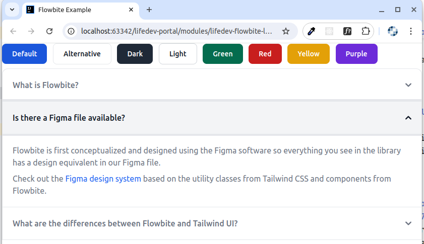

# Tailwind and Flowbite in Liferay

**Incorporating Tailwind Design System and Flowbite Components to Liferay**

## Introduction 

Liferay has its own design system based on Lexicon Design and Clay Components.
For regular use cases, they can satisfy customer needs, and user interfaces can be built by using out-of-the-box components.
But for more sophisticated user interfaces an external design system might be needed.
TailwindCSS is one of the most popular CSS frameworks, and Flowbite is a components library based on TailwindCSS.
This articles shows how to incorporate TailwindCSS / Flowbite to Liferay 7.4.

## TailwindCSS & Flowbite Integration

### Step1: Standalone Configuration

Before integrating to Liferay you can install & configure TailwindCSS and Flowbite separately.

_Note: but do this inside Lifeary workspace for future integration._

Create a folder for TailwindCSS/Flowbite, e.g. `lifedev-flowbite-loader`.

**Install TailwindCSS**

TailwindCSS can be installed by leveraging Tailwind CLI, or can be included using external CDN file.
The Tailwind CLI way is a preferred one, and provides more enhanced configuration options.

To install TailwindCSS run these commands:

```
npm install -D tailwindcss
npx tailwindcss init
```

Files `package.json` and `tailwind.config.js` should be created.

_Note: see detailed installation instructions at [Get started with Tailwind CSS](https://tailwindcss.com/docs/installation)_

**Create Tailwind styles file**

Create `tailwind.css` file with the following directives

```
@tailwind base;
@tailwind components;
@tailwind utilities;
```

to include Tailwind's styles.

**Install Flowbite**

To install Flowbite run the following command:

`npm install -D flowbite`

**Install PostCSS and Autoprefixer**

`PostCSS` is required to transform CSS with JavaScript plugins, while `Autoprefixer` is a `PostCSS` for applying vendor prefixes for CSS properties.

Install them using `npm install -D postcss autoprefixer` command.

Also, create a `postcss.config.js` file for PostCSS configuration:

```
module.exports = {
    plugins: {
        tailwindcss: {},
        autoprefixer: {},
    }
} 
```

**Adjust Tailwind configuration to use Flowbite plugin**

Add `require('flowbite/plugin')` to `plugins` array in `tailwind.config.js`.

**Verify Installation**

Add a build script in `package.json` to build CSS:

```
"scripts": {
    "build:css": "postcss tailwind.css -o output.css"
}
```

Install `PostCSS CLI` to be able to run `PostCSS` from command line:

`npm install -D postcss-cli`

Run build script: `npm run build:css`. As a result, output.css file should be created.

Create a sample `index.html` file to test installation: [index.html](modules/lifedev-tailwind-loader/index.html)

Copy some examples from Flowbite site and check appearance and behavior, sample:



_Note: Make sure to include dynamic components (e.g. Accordions) to verify JavaScript as well._ 

### Step 2: Wrapping with Gulp

In current implementation Tailwind is built with npm task, that invokes PostCSS plugin.

It's fine for simple configuration, but for more complex one it's better to use more powerful build tools, like Gulp.

Also, with Gulp you can perform additional step like merging or minification of the build files.

To proceed with gulp - install `gulp` dependency and related plugins, based on script logic. Sample command:

`npm install -D gulp gulp-postcss gulp-concat gulp-uglify gulp-clean-css gulp-rename`

- [gulp-postcss](https://www.npmjs.com/package/gulp-postcss)-  PostCSS gulp plugin;
- [gulp-concat](https://www.npmjs.com/package/gulp-concat) - plugin for files concatenation;
- [gulp-uglify](https://www.npmjs.com/package/gulp-uglify) - plugin for JavaScript minification;
- [gulp-clean-css](https://www.npmjs.com/package/gulp-clean-css) - plugin for CSS minification;
- [gulp-rename](https://www.npmjs.com/package/gulp-rename) - plugin for renaming files.

Here is an example of `gulpfile.js` that can be used for building JS/CSS files for Tailwind/Flowbite: [gulpfile.js](modules/lifedev-tailwind-loader/gulpfile.js)

```
const gulp = require('gulp');
const postcss = require('gulp-postcss');
var cleanCSS = require('gulp-clean-css');
const uglify = require('gulp-uglify');
const concat = require('gulp-concat');
const tailwindcss = require('tailwindcss');
const autoprefixer = require('autoprefixer');
const rename = require('gulp-rename');
const fs = require("fs");

const config = {
    css: {
        tailwind: 'tailwind.css',
        flowbite: 'node_modules/flowbite/dist/flowbite.css',
        target: 'build.min.css',
        tempTarget: 'flowbite-temp.min.css'  // Temporary file for Flowbite CSS
    },
    js: {
        src: 'node_modules/flowbite/dist/flowbite.js',
        target: 'build.min.js'
    },
    destination: 'src/main/resources/META-INF/resources'
}

// ---------------------- Flowbite CSS ----------------------
function buildFlowbiteCss() {
    return gulp.src(config.css.flowbite)    // Source File: Flowbite CSS
        .pipe(postcss([
            autoprefixer
        ]))                               // Process with PostCSS
        .pipe(cleanCSS())                 // Minify CSS
        .pipe(rename(config.css.tempTarget)) // Rename to temporary target file
        .pipe(gulp.dest(config.destination)); // Write to destination
}

// ---------------------- Tailwind CSS ----------------------
function buildTailwindCss() {
    return gulp.src(config.css.tailwind)   // Source File: Tailwind CSS
        .pipe(postcss([
            tailwindcss,
            autoprefixer
        ]))                               // Process with PostCSS
        .pipe(cleanCSS())                 // Minify CSS
        .pipe(gulp.dest(config.destination)); // Write to destination directory
}

// ---------------------- Concatenate Flowbite and Tailwind CSS ----------------------
function concatCss() {
    return gulp.src([`${config.destination}/${config.css.tempTarget}`, `${config.destination}/${config.css.tailwind}`]) // Source Files: Temp Flowbite CSS and Tailwind CSS
        .pipe(concat(config.css.target))  // Concatenate to target file
        .pipe(gulp.dest(config.destination)) // Write to destination
        .on('end', function() {
            // Optional: Delete the temporary file after concatenation
            fs.unlinkSync(`${config.destination}/${config.css.tempTarget}`);
            fs.unlinkSync(`${config.destination}/${config.css.tailwind}`);
        });
}

// ---------------------- Flowbite JS ----------------------
function buildJs() {
    return gulp.src(config.js.src)            // Source File: Flowbite JS
        .pipe(concat(config.js.target))       // Target File Name
        .pipe(uglify())                       // Minify JS
        .pipe(gulp.dest(config.destination)); // Write to destination
}

// Default Build Task
gulp.task('build', gulp.parallel(
        gulp.series(buildFlowbiteCss, buildTailwindCss, concatCss),
        buildJs
    ));
```

Here the main `build` tasks invokes child tasks for building Flowbite / Tailwind CSS files, concatenating them into a single file, and also building Flowbite JavaScript file.

Run `gulp build` command. As a result - two build files should be created in the destination folder: `build.min.css` / `build.min.js`.

Finally, verify the build process - adjust links in `index.html` to generated build files, and make sure everything is working properly.

### Step 3: Wrapping with Gradle as OSGi module

After TailwindCSS and Flowbite installation/configuration and defining Gulp build scripts, you can also wrap the installation with Gradle script to make it deployable to Liferay as an OSGi module.

Create the `build.gradle` file:

```
dependencies {
    compileOnly group: "com.liferay.portal", name: "release.portal.api", version: "7.4.3.120-ga120"
}
```

Also, create the bundle descriptor `bnd.bnd`, sample:

```
Bundle-Name: LifeDev Tailwind Loader
Bundle-SymbolicName: com.lifedev.tailwind.loader
Bundle-Version: 1.0.0
Web-ContextPath: /lifedev-tailwind-loader
```
_Note: define Web-ContextPath property to be able to reference files withing the assembled JAR using the specified context path._ 

After running `gulp build` to assemble the build files - run Gradle deploy task to deploy the OSGi module with the generated files.

Make sure you can access the files withing the deployed module:
- http://localhost:8080/o/lifedev-tailwind-loader/build.min.css
- http://localhost:8080/o/lifedev-tailwind-loader/build.min.js

### Step 4: Leveraging files as Client Extension

Once TailwindCSS / Flowbite files are deployed to Liferay - you can use them as Client Extensions: [CSS Client Extension](https://learn.liferay.com/w/dxp/liferay-development/customizing-liferays-look-and-feel/using-a-css-client-extension) / [JavaScript Client Extension](https://learn.liferay.com/w/dxp/liferay-development/customizing-liferays-look-and-feel/using-a-javascript-client-extension) for `build.min.css` / `build.min.js` files accordingly.

### Style Book

## Conclusion

Enjoy